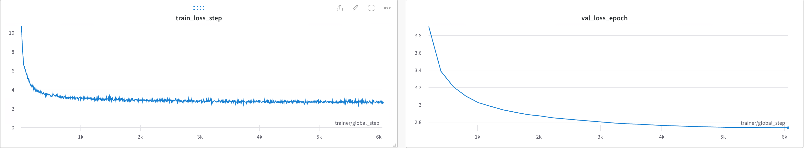
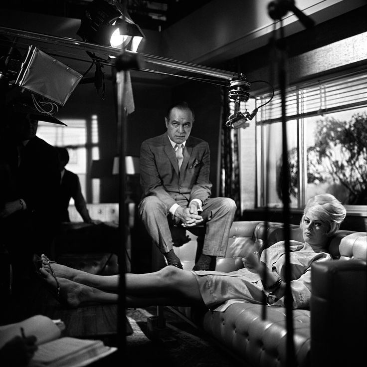
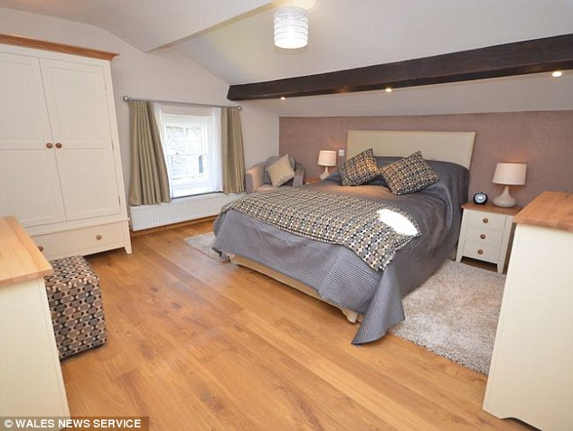

# 12_vlcc3m

## Loss Curves

## Examples

- gt : author : a life in photography -- in pictures
- pred : actor in a scene from the film

- gt : the - bedroom stone cottage can sleep people
- pred : the master bedroom has a double bed and a walk in wardrobe.

- gt : party in the park under cherry blossoms
- pred : a group of people in the park.

## Codebase
Based on the code of the layout-aware encoder + LLM project (in company), I worked on the model and dataset parts except for the training-related codes (optimizer, trainer, etc.).
